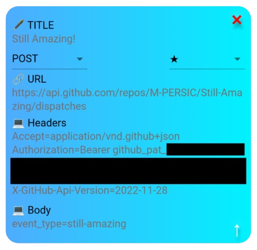

# Still Amazing! ✨

> A commit a day keeps the profile green... for that day!

Provides a basic webhook event-triggered workflow that appends the current date and time to a text file. 

My setup involves manually sending a POST request via the [HTTP app](https://github.com/activebridge/HTTP.git) on my [Amazfit Band 7](https://www.amazfit.com/products/amazfit-band-7) fitness tracker. This motivates me to keep active and start the day with the simple task of clicking a button. 

As an example on how to set up the HTTP app:

## License

This project is licensed under the [MIT License](https://spdx.org/licenses/MIT.html) - see the [LICENSE.md](./LICENSE.md) file for details.
